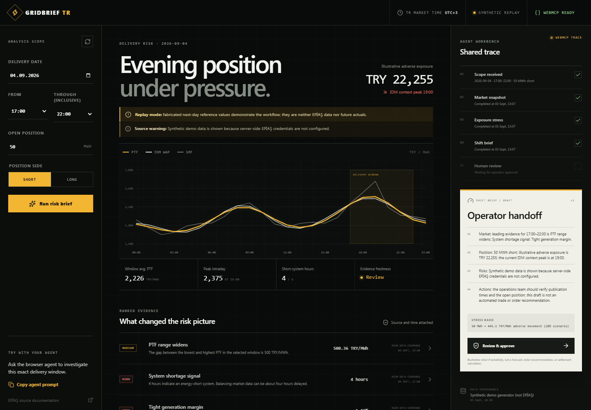

# GridBrief TR

[Live challenge demo](https://haakanergun.github.io/gridbrief-tr/) · [OpenAI WebMCP Challenge](https://webmcp.devpost.com/)

**GridBrief TR** is an agent-native risk workspace for participants in Türkiye's electricity market. It turns a market operator's question—such as “I am short 50 MWh for the next delivery day from 17:00 to 22:00; what should I watch?”—into a human-reviewable, source- and freshness-aware shift brief.

It is a decision-support prototype. It does not place orders, connect to a trading account, or recommend an execution. A human sets the exposure, changes assumptions, reviews the evidence, and explicitly approves a draft brief.



## Why WebMCP

Energy-market analysis often alternates between a participant's browser, operator data pages, spreadsheets, and a chat. That loses the user's selected scope and makes it hard to see which source and timestamp support an answer.

The information surface is substantial: EPİAŞ reports that its Transparency Platform served 28,006 registered users in 2025 through 181 report screens and 253 web services. Those figures describe the surrounding platform—not GridBrief's user count—and ground the workflow opportunity in a real operating context. See the official [EPİAŞ 2025 Annual Report](https://www.epias.com.tr/wp-content/uploads/2026/04/4-FAALIYET-RAPORU-2025.pdf).

GridBrief exposes the current workspace as WebMCP tools so a browser agent can operate *with* the user instead of merely describing the page:

1. `set_analysis_scope` sets the delivery date and time range;
2. `get_market_snapshot` reads the current market snapshot and its provenance;
3. `stress_test_position` tests a stated exposure against a disclosed what-if scenario; and
4. `draft_shift_brief` prepares an editable brief that preserves source, collection time, and mode labels.

The agent does the repetitive retrieval and synthesis; the human remains responsible for inputs, changed assumptions, and approval. This is deliberately read-only: no market action is exposed as a tool.

## Demo scenario

The included synthetic replay uses a **50 MWh short position for the next-day reference scenario dated 4 September 2026, 17:00–22:00 (Türkiye time)**. The browser agent sets that scope, gathers the labelled reference snapshot, runs a price stress, and drafts a brief. The user then changes an assumption and approves the revised brief. See [work/demo-script.md](work/demo-script.md).

The visible UI and `POST /api/market` use an **inclusive** ending hour: `17` through `22` covers 17:00–22:59. WebMCP's `endHour` is an **exclusive** boundary, so the agent uses `startHour: 17, endHour: 23` for that same delivery range.

## Data modes and integrity

GridBrief distinguishes its modes in the interface and in every brief:

| Mode | What it means |
| --- | --- |
| Live EPİAŞ | When both server-only credentials are configured, the gateway retrieves supported EPİAŞ Transparency Platform reports. A source and retrieval timestamp are attached to the snapshot. An individual upstream failure is returned as a null field plus a warning—never silently replaced with synthetic data. |
| Synthetic demo | Deterministic, clearly labelled demo data is used **only when EPİAŞ credentials are absent**. It is for workflow demonstration only and must not be interpreted as market data. |

EPİAŞ access requires a registered Transparency Platform account and an authentication token (TGT). The server obtains the TGT through EPİAŞ authentication, retains it only in server memory for up to two hours (with a five-minute renewal buffer), and never returns or logs the credential or TGT. Do not put credentials or tokens in browser code, prompts, screenshots, commits, or public deployments.

Data availability differs by report. A snapshot's retrieval timestamp and source note are evidence about when GridBrief received it, not a promise of real-time market data. In particular, the gateway notes that SMF and system direction can be about four hours delayed, consumption about two hours delayed, and generation may be available only through the preceding day. Missing live metrics are returned as null values with warnings rather than silently substituted values.

GridBrief is not affiliated with EPİAŞ. EPİAŞ is the named source where applicable; the product does not use EPİAŞ branding as its own.

The public challenge deployment neither retrieves nor redistributes EPİAŞ data. The optional server gateway is intended only for a user operating under their own authorized EPİAŞ account and remains subject to EPİAŞ terms and any applicable limits on use, storage, display, or redistribution.

Because the walkthrough's delivery window is in the future relative to its build date, the synthetic observations demonstrate the collaboration flow; they are not claimed as future actuals. A production next-day view would use day-ahead PTF plus appropriately licensed forecast and outage inputs, while delayed consumption, generation, SMF, and system-direction observations would appear only as current context. That temporal split is future work, not a capability claimed by this prototype.

The live gateway has documentation-mapped adapters for six EPİAŞ Transparency Platform reports: day-ahead market PTF, balancing-market SMF, intraday-market weighted-average price, real-time consumption, real-time generation, and system direction. See the official [EPİAŞ Electricity Service technical documentation](https://seffaflik.epias.com.tr/electricity-service/technical/tr/index.html). Complete a production and legal review before enabling live use.

## Run locally

Requirements: a current Node.js LTS release and npm.

```bash
npm install
npm run dev
```

Open the local URL printed by the dev server. Use **Demo / synthetic** mode for a credential-free walkthrough.

### Optional live EPİAŞ configuration

Create a local `.env` file from `.env.example`, then supply the server-only EPİAŞ values below. Never prefix them with `NEXT_PUBLIC_` and never commit `.env`.

```bash
EPTR_USERNAME=your_epias_username
EPTR_PASSWORD=your_epias_password
```

The gateway defaults to EPİAŞ's current `https://cas.epias.com.tr/cas/v1/tickets` ticket endpoint, as specified in its [CAS ticket-service announcement](https://www.epias.com.tr/tum-duyurular/piyasa-duyurulari/elektrik/kayit-ve-uzlastirma/cas-uygulamasindaki-ticket-tgt-alma-servisinde-degisiklik-2/). `EPTR_AUTH_URL` can override that server-side if EPİAŞ supplies an account-specific or future endpoint; never expose it with a `NEXT_PUBLIC_` prefix.

Live access is optional for the challenge demo. If configured live requests partially fail, the gateway returns warnings and null metrics. It does not downgrade a live request to synthetic data. Remove the credentials (or use a clean public deployment without them) for the explicitly labelled synthetic demo. The adapter has not been authenticated end-to-end in this public, credential-free challenge build.

## Test

```bash
npm run lint
npm run build
```

For a WebMCP verification, start the app in a supported browser-agent environment, open the workspace, and ask the agent to carry out the demo scenario. Confirm that the agent's calls visibly update the scope, snapshot, stress result, and draft; then edit an assumption manually and confirm the revised draft requires human approval.

Fast judge walkthrough:

1. Open the [live challenge demo](https://haakanergun.github.io/gridbrief-tr/) in ChatGPT's WebMCP-capable in-app browser, or in Chrome 149+ after enabling `chrome://flags/#enable-webmcp-testing` and restarting.
2. Confirm the header says `WebMCP ready`, then click **Copy agent prompt** and give that instruction to the browser agent.
3. Watch `DEMO TRACE` change to `WEBMCP TRACE` as the four tools update the visible scope, snapshot, stress result, and English draft.
4. Click **Review & approve** yourself; approval is intentionally not exposed as an agent tool.

The public build has also been exercised against Chrome 152's experimental WebMCP implementation: `getTools()` discovered all four tools and sequential `executeTool()` calls completed the scope, snapshot, stress, and draft flow without console errors.

The market gateway can also be checked without a browser agent:

```bash
curl http://localhost:3000/api/health
curl -X POST http://localhost:3000/api/market -H "Content-Type: application/json" -d '{"date":"2026-09-04","startHour":17,"endHour":22,"positionMwh":50,"side":"short"}'
```

## Deploy

Deploy the app to a Node-compatible host using the repository's standard build command:

```bash
npm run build
```

Add server-only EPİAŞ secrets only in the host’s encrypted environment configuration. The public challenge deployment runs in synthetic mode with no EPİAŞ secret configured. Before sharing a Node-compatible deployment, test the deployed URL, `GET /api/health`, the WebMCP tool registration, mode labels, and the no-secrets synthetic path.

### GitHub Pages fallback

The repository includes a GitHub Actions workflow that publishes the [public challenge demo](https://haakanergun.github.io/gridbrief-tr/) as a static, synthetic-only build. The workflow removes server-only API routes in its disposable checkout, builds with `GITHUB_PAGES=true` and `NEXT_PUBLIC_STATIC_DEMO=true`, and deploys the generated `out` directory. In this build only, form and WebMCP refreshes generate the same deterministic, clearly labelled synthetic snapshot directly in the browser; standard local and Node-compatible deployments continue to use `POST /api/market` unchanged. The Pages fallback intentionally has no `/api/*` endpoints.

## Project notes

- Challenge explanation and copy: [work/devpost-submission.md](work/devpost-submission.md)
- Recording plan: [work/demo-script.md](work/demo-script.md)
- Submission checks: [work/submission-checklist.md](work/submission-checklist.md)
- License: [MIT](LICENSE).

## Safety and limits

This prototype is not financial, legal, or operational advice. It does not calculate collateral, credit, imbalance settlement, or an executable hedge. Scenario values are transparent sensitivity calculations, not forecasts. Validate data, timestamps, market rules, and any decision in the participant’s approved risk process.
